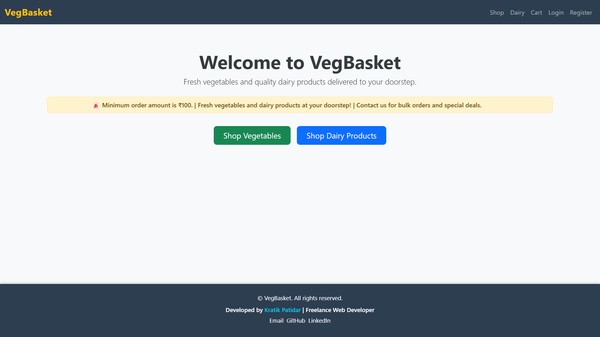
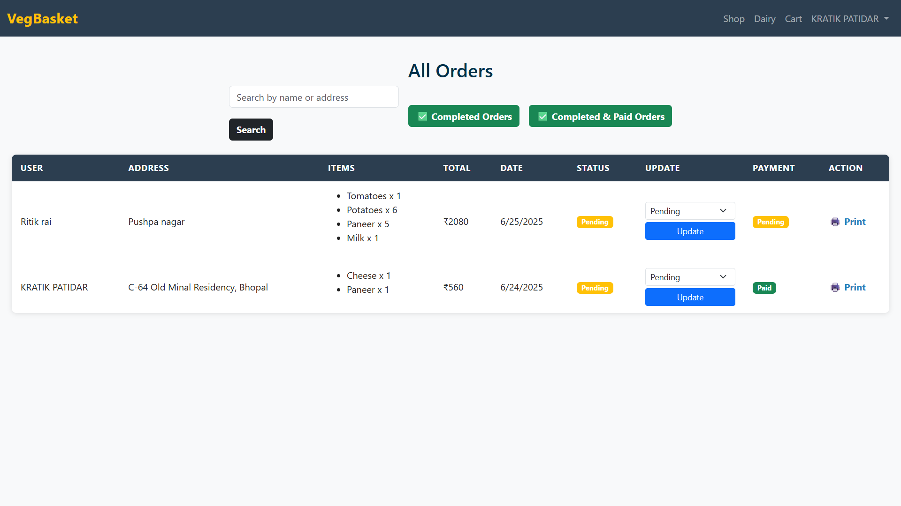

# 🥕 VegBasket - Online Vegetable & Dairy Ordering App

**VegBasket** is a full-stack web application designed to help local vendors sell vegetables and dairy products efficiently within a 5–6 km radius. Users can browse items, place orders, and pay online or with cash, while the admin can manage orders and inventory from a dedicated dashboard.

---

## 🔗 Live Demo

👉 [Visit VegBasket](https://vegbasket-czog.onrender.com/)  

---

## 📸 Screenshots

| User View | Admin Panel |
|-----------|-------------|
 |  | 
 |

---

## 🚀 Features

### 👥 User Side
- ✅ User registration & secure login (session-based)
- ✅ Browse vegetables & dairy products
- ✅ Add to cart with quantity control
- ✅ Checkout with:
  - 🧾 Cash on Delivery
  - 💳 Razorpay Online Payment
- ✅ View and track orders

### 🛠️ Admin Side
- ✅ Admin login panel
- ✅ View all user orders
- ✅ Mark orders as completed or paid
- ✅ Filter by order status
- ✅ Add/Edit/Delete products

---

## 🧰 Tech Stack

**Frontend:**
- HTML, CSS, Bootstrap
- EJS (Embedded JavaScript Templates)

**Backend:**
- Node.js
- Express.js
- MongoDB + Mongoose

**Others:**
- Razorpay Payment Gateway
- express-session with connect-mongo
- dotenv, helmet for configuration and security

---

